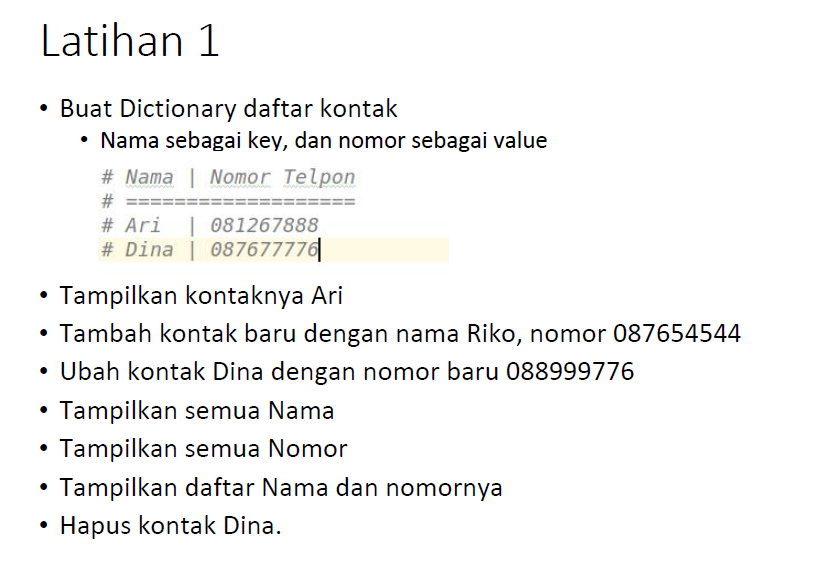
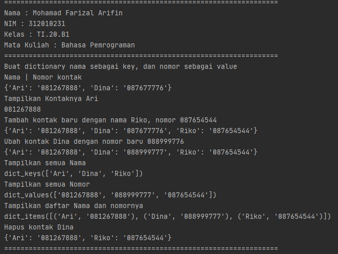
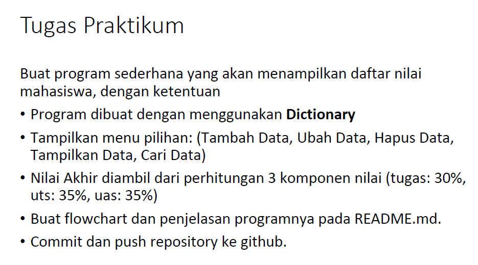
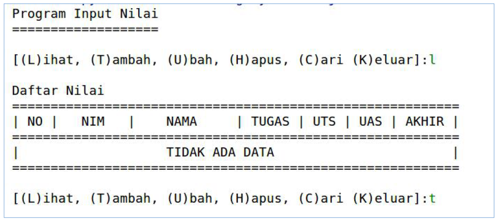
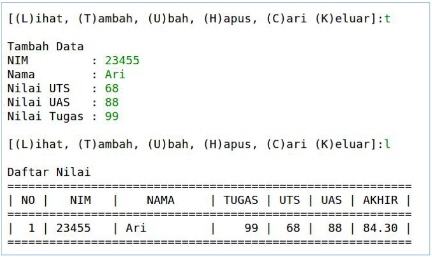

# Pertemuan9-praktikum5

Repositiry ini dibuat untuk memenuhi tugas Pertemuan 9 - Bahasa Pemrograman (Module Praktikum 5)<br><br>
Nama : Mohamad Farizal Arifin <br>
NIM : 312010231<br>
Dosen : Agung Nugroho, M.Kom<br>
Matkul : Bahasa Pemrograman<br>
Kelas : TI.20.B.1<br>

Pada halaman ini (Tugas Pertemuan-9-Module Praktikum 5) Dosen memberi tugas sebagai berikut : <br>
* Soal Latihan yang ada pada module praktikum 5<br>
<br>
* Berikut adalah program syntax yang saya buat untuk memenuhi latihan module 5<br>

``` python
print("===================================================================")
print("Nama : Mohamad Farizal Arifin")
print("NIM : 312010231")
print("Kelas : TI.20.B1")
print("Mata Kuliah : Bahasa Pemrograman")
print("===================================================================")

# Buat dictionary daftar kontak
print("Buat dictionary nama sebagai key, dan nomor sebagai value")

isi = {'Ari': '081267888', 'Dina': '087677776'}
print("Nama | Nomor kontak")
print(isi)

print("Tampilkan Kontaknya Ari")
print(isi['Ari'])

print("Tambah kontak baru dengan nama Riko, nomor 087654544")
isi['Riko']= '087654544'
print(isi)

print("Ubah kontak Dina dengan nomor baru 088999776")
isi['Dina']= '088999777'
print(isi)

print("Tampilkan semua Nama")
print(isi.keys())

print("Tampilkan semua Nomor")
print(isi.values())

print("Tampilkan daftar Nama dan nomornya")
print(isi.items())

print("Hapus kontak Dina")
del isi['Dina']
print(isi)

print("===================================================================")
```
* Ini adalah hasil run dari syntax latihan module 5 yang saya buat <br>
<br>

* Soal Tugas Praktikum yang ada pada module praktikum 5 adalah sebagai berikut<br>
<br>
* Berikut hasil yang diinginkan pada soal praktikum  5<br>
<br>
<br>