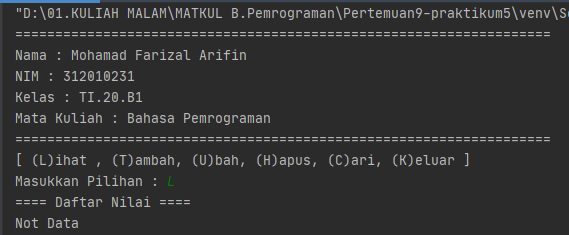
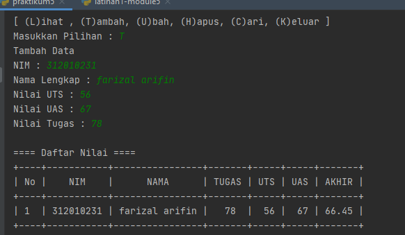
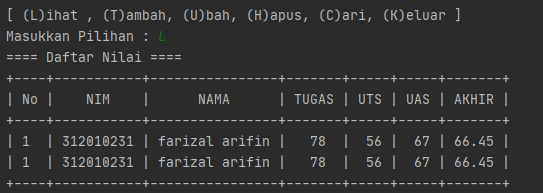
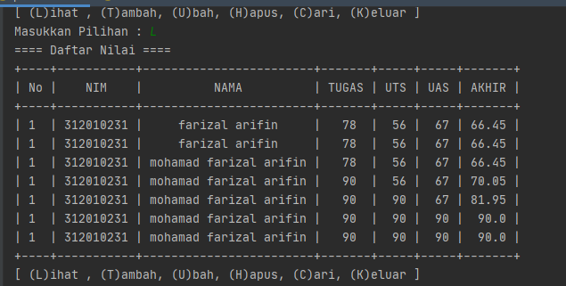
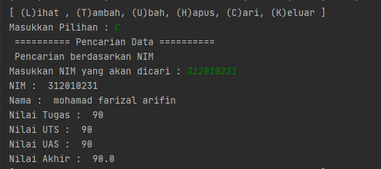
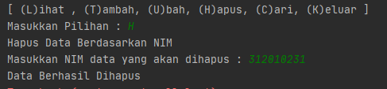
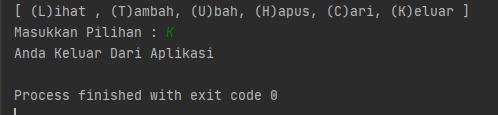

# Pertemuan9-praktikum5

Repositiry ini dibuat untuk memenuhi tugas Pertemuan 9 - Bahasa Pemrograman (Module Praktikum 5)<br><br>
Nama : Mohamad Farizal Arifin <br>
NIM : 312010231<br>
Dosen : Agung Nugroho, M.Kom<br>
Matkul : Bahasa Pemrograman<br>
Kelas : TI.20.B.1<br>

Pada halaman ini (Tugas Pertemuan-9-Module Praktikum 5) Dosen memberi tugas sebagai berikut : <br>
* Soal Latihan yang ada pada module praktikum 5<br>
<br>
* Berikut adalah program syntax yang saya buat untuk memenuhi latihan module 5<br>

``` python
print("===================================================================")
print("Nama : Mohamad Farizal Arifin")
print("NIM : 312010231")
print("Kelas : TI.20.B1")
print("Mata Kuliah : Bahasa Pemrograman")
print("===================================================================")

# Buat dictionary daftar kontak
print("Buat dictionary nama sebagai key, dan nomor sebagai value")

isi = {'Ari': '081267888', 'Dina': '087677776'}
print("Nama | Nomor kontak")
print(isi)

print("Tampilkan Kontaknya Ari")
print(isi['Ari'])

print("Tambah kontak baru dengan nama Riko, nomor 087654544")
isi['Riko']= '087654544'
print(isi)

print("Ubah kontak Dina dengan nomor baru 088999776")
isi['Dina']= '088999777'
print(isi)

print("Tampilkan semua Nama")
print(isi.keys())

print("Tampilkan semua Nomor")
print(isi.values())

print("Tampilkan daftar Nama dan nomornya")
print(isi.items())

print("Hapus kontak Dina")
del isi['Dina']
print(isi)

print("===================================================================")
```
* Ini adalah hasil run dari syntax latihan module 5 yang saya buat <br>
<br>

* Soal Tugas Praktikum yang ada pada module praktikum 5 adalah sebagai berikut<br>
<br>
* Berikut hasil yang diinginkan pada soal praktikum  5<br>
<br>
<br>

* Setelah memahami materi saya membuat syntax sebagai berikut untuk memenuhi tugas praktikum module 5 : <br>
```python
from prettytable import PrettyTable

print("===================================================================")
print("Nama : Mohamad Farizal Arifin")
print("NIM : 312010231")
print("Kelas : TI.20.B1")
print("Mata Kuliah : Bahasa Pemrograman")
print("===================================================================")

baris = []
x = PrettyTable()

while True:
    print("[ (L)ihat , (T)ambah, (U)bah, (H)apus, (C)ari, (K)eluar ]")
    tanya = input("Masukkan Pilihan : ")
    if tanya == "L":
        print("==== Daftar Nilai ====")
        no = 0
        no += 1
        x.field_names = ["No", "NIM", " NAMA", "TUGAS", "UTS", "UAS", "AKHIR"]
        if not baris:
            x.field_names = ["No", "NIM", " NAMA", "TUGAS", "UTS", "UAS", "AKHIR"]
            print("Not Data")
        else:
            for data in baris:
                x.add_row([no, data["nim"], data["nama"], data["tugas"], data["uts"], data["uas"], data["akhir"]])
            print(x)
    elif tanya == "T":
        print("Tambah Data ")
        nim_v = input("NIM : ")
        nama_v = input("Nama Lengkap : ")
        uts_v = input("Nilai UTS : ")
        uas_v = input("Nilai UAS : ")
        tugas_v = input("Nilai Tugas : ")
        akhir_v = 0.3 * float(tugas_v) + 0.35 * float(uts_v) + 0.35 * float(uas_v)
        baris.append({"nim": nim_v, "nama": nama_v, "tugas": tugas_v, "uts": uts_v, "uas": uas_v, "akhir": akhir_v})
        print()
        print("==== Daftar Nilai ====")
        i = 0
        for data in baris:
            i += 1
            x.field_names = ["No", "NIM", " NAMA", "TUGAS", "UTS", "UAS", "AKHIR"]
            x.add_row([i, data["nim"], data["nama"], data["tugas"], data["uts"], data["uas"], data["akhir"]])
        print(x)
    elif tanya == "U":
        print("Edit File")
        print("Data siapa yang akan diubah ?")
        siapa = input("Masukkan NIM Mahasiswa yang akan diubah : ")

        print("Data apa yang akan diubah ? : ")
        mhs = input(" 1. Nama \n 2. Nilai Tugas \n 3. Nilai UTS \n 4. Nilai UAS\n Pilih dengan angka (1/2/3/4) : ")
        if mhs == "1":
            ubahnama = input("Silahkan masukan nama yang benar : ")
            i = 0
            d = next(item for item in baris if item['nim'] == siapa)
            d['nama'] = ubahnama
            x.field_names = ["No", "NIM", " NAMA", "TUGAS", "UTS", "UAS", "AKHIR"]
            i += 1
            x.add_row([i, d["nim"], d["nama"], d["tugas"], d["uts"], d["uas"], d["akhir"]])
            print(x)
        elif mhs == "2":
            ubahtugas = input("Masukkan Nilai Tugas yang benar : ")
            i = 0
            d = next(item for item in baris if item['nim'] == siapa)
            d['tugas'] = ubahtugas
            lihatuts = d['uts']
            lihatuas = d['uas']
            lihatakhir = 0.3 * float(ubahtugas) + 0.35 * float(lihatuts) + 0.35 * float(lihatuas)
            d['akhir'] = lihatakhir
            x.field_names = ["No", "NIM", " NAMA", "TUGAS", "UTS", "UAS", "AKHIR"]
            for data in baris:
                i += 1
                x.add_row([i, data["nim"], data["nama"], data["tugas"], data["uts"], data["uas"], data["akhir"]])
            print(x)
        elif mhs == "3":
            ubahuts = input("Masukkan Nilai UTS yang benar : ")
            i = 0
            d = next(item for item in baris if item['nim'] == siapa)
            d['uts'] = ubahuts
            lihattugas = d['tugas']
            lihatuas = d['uas']
            lihatakhir = 0.3 * float(lihattugas) + 0.35 * float(ubahuts) + 0.35 * float(lihatuas)
            d['akhir'] = lihatakhir
            x.field_names = ["No", "NIM", " NAMA", "TUGAS", "UTS", "UAS", "AKHIR"]
            for data in baris:
                i += 1
                x.add_row([i, data["nim"], data["nama"], data["tugas"], data["uts"], data["uas"], data["akhir"]])
            print(x)
        elif mhs == "4":
            ubahuas = input("Masukkan Nilai UAS yang benar : ")
            i = 0
            d = next(item for item in baris if item['nim'] == siapa)
            d['uas'] = ubahuas
            lihattugas = d['tugas']
            lihatuts = d['uts']
            lihatakhir = 0.3 * float(lihattugas) + 0.35 * float(lihatuts) + 0.35 * float(ubahuas)
            d['akhir'] = lihatakhir
            x.field_names = ["No", "NIM", " NAMA", "TUGAS", "UTS", "UAS", "AKHIR"]
            for data in baris:
                i += 1
                x.add_row([i, data["nim"], data["nama"], data["tugas"], data["uts"], data["uas"], data["akhir"]])
            print(x)
        else:
            print("Pilihan Salah")

    elif tanya == "C":
        print(" ========== Pencarian Data ==========")
        print(" Pencarian berdasarkan NIM ")
        carinim = input("Masukkan NIM yang akan dicari : ")
        xdata = next(item for item in baris if item['nim'] == carinim)
        print("NIM : ", carinim)
        print("Nama : ", xdata['nama'])
        print("Nilai Tugas : ", xdata['tugas'])
        print("Nilai UTS : ", xdata['uts'])
        print("Nilai UAS : ", xdata['uas'])
        print("Nilai Akhir : ", xdata['akhir'])
    elif tanya == "H":
        print("Hapus Data Berdasarkan NIM")
        datahapus = input("Masukkan NIM data yang akan dihapus : ")
        xhapus = next(item for item in baris if item['nim'] == datahapus)
        del xhapus['nim']
        del xhapus['nama']
        del xhapus['tugas']
        del xhapus['uts']
        del xhapus['uas']
        del xhapus['akhir']
        print("Data Berhasil Dihapus")
        no = 0
        no += 1
        x.field_names = ["No", "NIM", " NAMA", "TUGAS", "UTS", "UAS", "AKHIR"]
        if not baris:
            x.field_names = ["No", "NIM", " NAMA", "TUGAS", "UTS", "UAS", "AKHIR"]
            print("Not Data")
        else:
            for data in baris:
                x.add_row([no, data["nim"], data["nama"], data["tugas"], data["uts"], data["uas"], data["akhir"]])
            print(x)

    elif tanya == "K":
        print("Anda Keluar Dari Aplikasi")
        break
    else:
        print("Anda Memilih Pilihan Yang Salah")
```
* Berikut ini adalah hasil run dari syntax diatas akan diuraikan satu persatu<br>
* *Lihat data sebelum data ditambahkan*<br>
<br>
* *Tambah data*<br>
<br>
* *Lihat setelah tambah data*<br>
<br>
* *Ubah data, dan pada gambar dibawah adalah hasil dari perubahan data*<br>
<br>
* *Mencari data yang diinputkan*<br>
<br>
* *Menghapus data yang diinputkan*<br>
<br>
* *Keluar dari program aplikasi*<br>
<br>
### Demikian tugas untuk pertemuan 9 module 5 yang bisa saya sampaikan, Terima kasih...